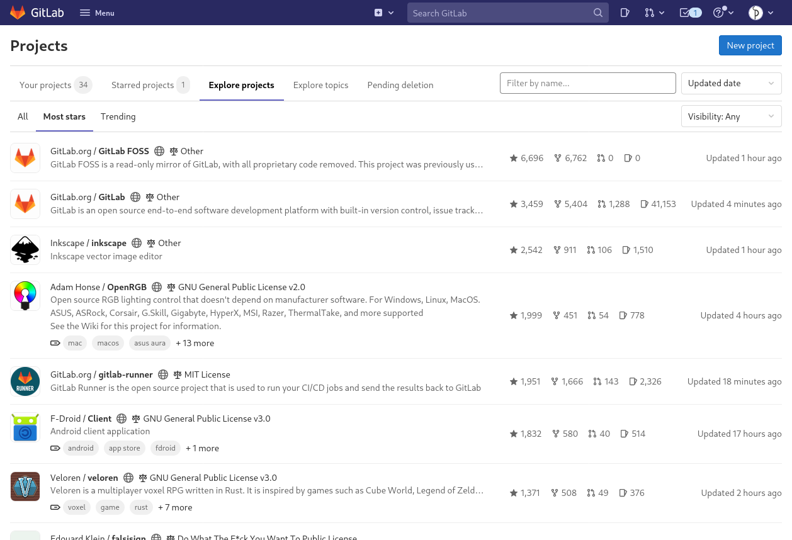

::: questions

- What is GitLab?
- How can I find my way around GitLab?

:::

::: objectives

- State the primary entity of organization.
- Use GitLab’s interface to find a project.
- State one purpose of groups.
- Use GitLab’s interface to find group.

:::

## Introduction

GitLab is a web application for managing software projects. However, the
features it provides can also be used for related purposes; for example, issue
or task management, document management or project management in general.

GitLab is open source software and can be run by anyone on their own hardware.
The company behind the software runs one so called instance under
<https://gitlab.com> where anyone (resident in a country or territory not
sanction by the USA) can create an account and use it within certain limits for
free. But there are also instances run by diverse people and institutions from
hobbyists over small NGOs to large organizations (e.g.
<https://gitlab.dlr.de/>). Those are not necessarily publicly accessible.

GitHub is a direct competitor to, and probably inspiration for, GitLab. Unlike
GitLab, GitHub is not open source software, but large customers can run their
own instances. With respect to the content covered by this lesson they are very
similar and only differ in details. So, if you are already familiar with using
GitHub, all this lesson can probably teach you is how concepts already familiar
to you from GitHub are called in GitLab.

## Finding Projects

::: challenge

### Log in to GitLab

Navigate to to GitLab.com’s [sign in page][GitLabSignIn] and log in to your
account. Once logged in, have a look at what projects you can see in the first
three tabs (“Your projects”, “Starred projects”, and “Explore projects”). Play
around with the filters and sort settings.

This exercise should take about 5 minutes.

:::

When we log into GitLab for the first time, we are greeted by a welcome page,
offering us four ways to move forward:

- “Create a project”
- “Create a group”
- “Explore public projects”
- “Learn more about GitLab”

We will cover how to create a project and a group in the next episode. For now,
we want to learn how to navigate GitLab. For that we select “Explore public
projects”. This leads us to the projects overview page. The project is the main
organizational unit of GitLab.

::: callout

### Homepage

The welcome page is only shown as long as we are not a member of any project
yet.
On instances other than GitLab.com it might also not be shown.
In those cases the configured homepage is shown.

The project overview page is the default homepage.
However, the homepage is a configuration option for GitLab instances as well as individual users; the latter overriding the former.
You may have changed that setting or an administrator might have changed the global configuration of the instance.

You can always navigate to the project overview page by selecting one of the subentries of the “Projects” option in the menu accessible from the menu button on the left side of the top menu bar or the “Projects” entry from the sidebar menu on the left.

:::

Depending on whether you have used GitLab before or have been assigned to a group by someone else you may see some or no projects under the first two tabs, “Your projects” and “Starred projects”.
But on GitLab’s own instance you will certainly see projects under the “Explore projects” tab.
For example, while writing the lesson material the tab looked like this:

{alt="Project overview page with
tab “Explore projects” and subtab “Most stars” open. The tab shows a list of
projects with icon, name, descriptions, and four statistical values for each
entry."}

The first tab, “Your projects”, lists all projects that you are a member of.
When you create a project you automatically become a member.
In addition, others can add you as a member to a project.
We will learn about another way to become a member of a project in the [episode on groups](05-groups.md).

The second tab, “Starred projects”, lists projects that you have “starred”.
In this context, “starring” is similar to bookmarks in a browser.
Every project homepage shows a widget in the upper right corner labeled “Star”.
By pressing it you “star” the project and thus make it appear in that list.

The third tab, “Explore projects”, lists all projects that you can access. This
includes all projects from the “Your projects” tab as well as all projects that
are publicly visible.

::: callout

### Visiblity

GitLab offers three settings for the visibility of a project: public, internal, and private.
Publicly visible projects can be looked at by anyone that can access the GitLab instance, projects with internal visibility can be looked at by anyone logged in to the instance, while projects with private visibility can only be looked at by its members.

On GitLab.com the visibility “internal” is disabled. Everyone can create an
account, log in to the instance, and thus could look at any project of
internal visibility anyway.

Self-hosted instances might also disable some visibility types. For example,
the public visibility might be disabled, to prevent users from publishing
something to the whole internet.

:::

When working with GitLab, most of the time you will want to access projects you are already a member of (in the GitLab sense).
In that case the list on the “Your projects” will be all that you need to find the project you are looking for.
When the list becomes long, the search field next to the tabs allows you to filter the projects by name, just as the placeholder text suggests.

You can also use that search field on the “Explore projects” tab to search
through all projects that you can look at.

The search field in the top menu bar can also be used to find projects. It
shows other search results, too, but clearly labels what is what.

Finally, you can use the search field under “Projects” in the menu accessible from the menu button on the left side of the top menu bar to search for projects.

::: challenge

### Finding a project

Use the search methods GitLab provides to find the project page for the software
“Inkscape”.

This exercise should take about 5 minutes.

:::: solution

The project page is located at <https://gitlab.com/inkscape/inkscape>. If you
found yourself at https://gitlab.com/inkscape you found the group page of the
Inkscape community.

::::

:::

## Finding Groups

The second organizational entity, next to projects, are groups.
Groups can contain projects and other groups and can therefore be used to structurally organize multiple projects.
In a later episode, when we talk about members of groups and projects, we learn about another use for groups.

Groups and projects work somewhat similar to directories and files in the file
system. Every group and every project can be contained in only one group and a
group cannot contain itself.

To make our lives easier later on, we introduce two terms regarding a group’s
position in this system:

- A group not contained in another group is called **top-level group**.
- A group contain in another group is called a **subgroup** of that group.

::: challenge

### Top-level groups and Subgroup

On the group page https://gitlab.com/inkscape identify the top-level group’s
name and one subgroup or contained project of that group.

Hint: Note that groups cannot be starred.

This exercise should take about 5 minutes.

:::: solution

- The top-level groups name is Inkscape as it is written at the top of the main content.
- Any entry in the list “Subgroups and projects” is a subgroup or a contained project.

::::

:::

Similar as for projects, GitLab provides an overview page for groups.
You can navigate there by selecting one of the subentries of the “Groups” option in the menu accessible from the menu button on the left side of the top menu bar or the “Groups” entry from the sidebar menu on the left.

The two tabs on that page, “Your groups” and “Explore public groups” work
analogously to their corresponding tabs on the project overview page discussed
above.

For finding groups there are analogous search options as mentioned for projects
before.

[GitLabSignIn]: https://gitlab.com/user/sign_in

::: keypoints

- Projects are GitLab’s primary entity of organization.
- Projects you have access to are listed in the “Your projects” tab on the project overview page.
- The project overview page is GitLab’s homepage unless configured differently.
- You can search for projects in the top menu, the top search bar and on the “Explore projects” tab of project overview page.
- A project’s visibility can be set to either private, internal, or public.
- On some instances a visibility class is disabled.
- Groups can contain projects and other groups.
- A top-level group is a group not contained in another.
- A subgroup is a group contained in another.
- Groups you have access to are listed in the “Your groups” tab on the group overview page.
- You can search for groups in the top menu, the top search bar and on the “Explore groups” tab of group overview page.

:::
