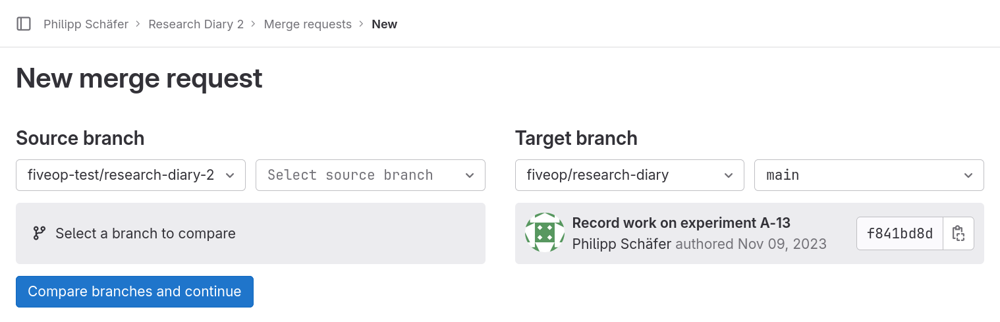

::: questions

- How can I contribute to a project on GitLab?

:::

::: objectives

- Fork a project.
- Create and edit a file on GitLab.
- Create/Accept a merge request.
- Mention an issue in GitLab markdown.

:::

In the episode on collaboration, we learned how to contribute changes to a project that we are a member of.
We also learned, in the previous episode, that we can contribute to other projects by filing issues to report problems or ask questions.
In this episode, we will learn about a way to suggest concrete changes to a GitLab project to which we have no write access.

The feature that allows us to do this is called Merge Request, the corresponding feature on GitHub is called Pull Request.
As a target for our merge request, we will use our co-learners repository.
We do have write access to it, but sometimes even then we want to suggest changes instead of just making them.

We will create a merge request for a file that lists the contributors.
This will solve the issue that we filed during the previous episode.

## Create a Fork

Since we are a member of our co-learner’s project we could create a merge request within the project.
But this is no longer true if we ever want to suggest changes to a project that we are not a member of.
So, to learn a little more, we will make ourselves some extra work.

So, suppose that we cannot make changes to our co-learner’s project.
We need a copy that we can change.
Such a copy is called a fork in GitLab’s (and also GitHub’s) case.
The term can be explained by looking at its use in “fork in the road”:
Once we make changes to our copy, the development history will have forked into two different directions.

To create a fork, we navigate to the homepage of our co-learner’s project.
In the upper right corner is a button labeled ”Forks”.
The number next to it tells us how many forks of this repository exist on GitLab.
We will now increase that number by one by clicking on the button.

This redirects us to a form that looks like a reduced version of the “Create new project” form, which correctly indicates that by forking, we create a new project.

We need to select a namespace (group or our personal space) in which the fork should be created.
We click on the drop-down list under “Project URL” and select our username.

::: callout

### Unique Project Name

If there already is a project with the name or the same slug, GitLab will show you an error message when you try to create the for.
At the time of me writing this, the message can be summarized to “an error has occurred”, which is not very helpful.
If that happens, reload the page, select a different name and/or slug and try again.

:::

Now we click the “Fork project” button.

We are redirected to the fork’s project home page.
The fork is a full featured project just like the original, however, only the Git repository is copied.
So, for example, there are no issues in it, even though the original had at least one.

## Create and Edit a File on GitLab

Our goal is to create a file that lists contributors of the project.
We will do this within GitLab using its file creation and editing features.

To add a file, we click on the button labeled “Edit” towards the right of page above the list of files, and select WebIDE from the popup-menu.
This redirects us to a page with a file browser in a
column on the left, with most of the screen taken up by a box welcoming us to the WebIDE.

We do not want to edit an existing file, but want to create a new one. To do
that we click on the button above the list of files on the left that is marked
with an icon representing a sheet of paper with a +-sign on top of it.
The button is only visible, when the mouse hovers over the list of files.

A pop-up dialog prompts us for a name, which we will provide: `CONTRIBUTORS.md`.
Then we confirm the file name by pressing the return key.

::: callout

### All caps filenames

In software projects it is customary to name certain files with information about the project in all caps.
One example we already encountered is the README file.
Others are the file containing the license (`LICENSE`), a file about how to contribute (`CONTRIBUTING`), or how to install the software (`INSTALL`).

Sometimes a file extension indicating the format is appended, usually in
lower-case letters.

:::

We see the result of our action in two ways: A file named “CONTRIBUTORS.md”
appeared in the list of files on the left and a tab labeled “CONTRIBUTORS.md”
showing an text editor appeared in the space to the right of the list of files.

We will now add something similar the following lines in the editor:

```markdown
The following persons have contributed to my research diary:

- Conner Learner
```


To save the changes, the creation of the file and the text we entered, we need to create a so called commit.
A commit packages changes in one or more files of the repository.
The list of commits, in chronological order, constitute the history of a Git repository.

To get there, we click on the button on the left showing an icon that indicates a branching from one circle to two others.
The button should be overlaid with the number 1 in a circle.

A dialog will replace the list of files.
At the top is a text field for a commit message.
Then comes a button labeled “Commit & Push”, followed by a list of all files that were changed, added, or deleted.

We enter an appropriate commit message, for example

```
Add CONTRIBUTORS.md
```

and click the button labeled “Commit to 'main'”.

In the dialog that pops up in the center top of the screen, we select “Continue”.

## Create a Merge Request

Having created the commit, we navigate back to the project home page.
We lick on the button labeled “GitLab” in the lower left of the screen and select “Go \<project name\> project on GitLab” from the list that pops up at the top.

We notice that the file that we created is now present in the list of files.

To create a merge request, we click on the menu item labeled “Merge requests” in
the menu on the left and on the following page on the button labeled “New merge
request”.

This gets us to the following dialog:

{alt="New merge request page.
Below the page title, “New merge request”, there are two UI elements side-by-side.
The one on the left, titled ”Source branch”, has two drop-down fields, one to select the project, the other to select the branch.
The former reads “fiveop-test/research-diary-2”, the latter “Select source branch”.
Below the two drop-down files is a box stating “Select a branch to compare”
The UI element on the right, titled “Target branch”, has the same two drop-down fields.
In this case the former reads “fiveop/research-diary” and the latter ”main”.
Below the two drop-down fields is a box with information about the last commit on the “main” branch: message, author, date and identifier prefix.
At the bottom of the page is a button labeled “Compare branches and continue”.
"}

On the left side, we select the main branch for our change.
Once done, a box with details of the last commit on that branch appears below the drop-down fields on the left.

We click the button labeled “Compare branches and continue”.
On the following page, we can see that a merge request has its own title and description.
They are prefilled with the newest commit message of the source branch.
To connect this merge request with the issue that we filed, we write

```
Resolves #1
```

in the merge request description.
Everything else, we leave with its default value or in its default state.

::: callout

### Closing Issues Automatically

Whenever a merge request is merged to the default branch of a project and its description or the description of one of its commits contains the phrase `<keyword> #<number>` for one of the [keywords mentioned in GitLab’s documentation](https://docs.gitlab.com/ee/user/project/issues/managing_issues.html#default-closing-pattern), then the issue with number `<number>` is closed automatically.

This can save a few clicks and ensures that closing the issue will not be
forgotten.

:::

We click the button labeled “Create merge request”. This leads us to the page
for the created merge request. It looks similar to the page for an issue.The
main difference are the tabs, their headers being located just below the title:
“Overview” (the one that is shown initially), “Commits”, “Pipelines”, and “Changes”.

Clicking on the tab header labeled “Commits”, we see a list of all the commits
of this merge request, which in our case is the commit we created.

We ignore the tab labeled “Pipelines”.

Clicking on the tab header labeled “Changes”, we see a so called diff for each of the changed files.
In our case a file was added, so all the lines in the file are new, indicated by the plus sign at the beginning of each line and the background color green.

Back on the “Overview” tab, below the description there is button to “Approve“ the merge request.
By default this is optional, but a project can be configured to require approval of merge requests by a certain group of members.
Then there is a grayed-out button labeled “Merge”, followed by text that we need to ask someone with write access to click it.
We will do exactly that in a moment.
Note also, that the box around it mentions that the merge request mentions the issue.
This can otherwise be easily overlooked, if the mention happens in a commit message of the merge request.

Finally at the bottom, we see that a merge request can be commented on, just like an issue.

But for merge request there is more.
Navigating to the “Changes” tab and hovering the mouse over a line number, we see a speech bubble button appear at the start of the line.
When we press it, a text field for a comment appears.
We can use that to comment on individual lines.
This feature allows users to have separate discussions for different changes of a merge request.

::: callout

### Code Review

Being able to comment on individual lines is a useful feature for a practice
called code review. Code review entails that a peer of the author of some
changes reviews those, before they are merged. This practice is the origin of
the merge request feature, but it lends itself as well to reviewing text based
changes other than code.

:::

## Accept a Merge Request

While we were creating the merge request for our co-learner’s repository, they
did the same for ours. Now it is time to review and accept those changes.

Navigate to the issue your co-learner created in your repository. At the very
bottom of the issue’s history you will see en entry of the form “Co-learner
@colearner mentioned in merge request !1 2 minutes ago”. The merge request
reference, ”!1”, is a link. We follow the link by clicking on it.

This leads us to the merge request page, very similar to the page of our own merge request.
The difference, that we are interested in, is the state of the button labeled “Merge”.
The button is no longer disabled.
Above the button is a line of text that informs us that one commit and one merge commit will be added to branch 'main'.

The merge commit serves as a common descendant of the heads of your main branch
and the branch on which your co-learner based their merge request.

We click on the button labeled “Merge”. After a few seconds the box that allowed
us to merge is replaced by a box that informs us about the successful merge.

In particular, there still is a sentence informing us that the merge request
mentions an issue. Our intention was for that issue to be closed, so we click on
the issue reference, for example “#1”, to check.

On the issue page, we can see that indeed the issue was closed. The last entry
in the issue’s history reads similar to “Co-learner closed via commit abcdef12
just now”, informing us why the issue was closed.

::: keypoints

- You can create a project with a copy of another project’s repository by
  forking it.
- You can suggest changes to a project that you have no write access to through
  a merge request.
- You can close issues by use of certain keywords in merge request descriptions
  or commit messages.

:::
