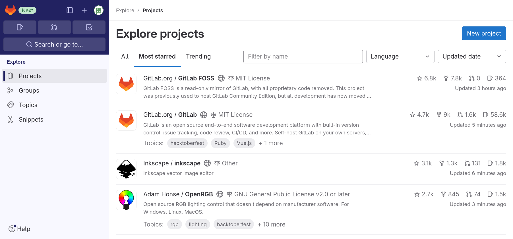

::: questions

- What is GitLab?
- How can I find my way around GitLab?

:::

::: objectives

- State the primary entity of organization.
- Use GitLab’s interface to find a project.
- State one purpose of groups.
- Use GitLab’s interface to find group.

:::

## Introduction

GitLab is a web application for managing software projects. However, the
features it provides can also be used for related purposes; for example, issue
or task management, document management or project management in general.

GitLab is open source software and can be run by anyone on their own hardware.
The company behind the software runs one instance under <https://gitlab.com> where anyone (resident in a country or territory not sanctioned by the USA) can create an account and use it within certain limits for free.
But there are also instances run by diverse people and institutions from hobbyists, over small NGOs, to large organizations (e.g. <https://gitlab.dlr.de/>).
Those are not necessarily publicly accessible.

GitHub is a direct competitor to, and probably an inspiration for, GitLab.
Unlike GitLab, GitHub is not open source software, but large customers can run their own instances.
With respect to the content covered by this lesson GitLab and GitHub are very similar and only differ in details.
So, if you are already familiar with using GitHub, all this lesson can probably teach you is how concepts already familiar to you from GitHub are called in GitLab.

## Finding Projects

::: challenge

### Log in to GitLab

Navigate to to GitLab.com’s [sign in page][GitLabSignIn] and log in to your account.

This exercise should take about 1 minute.

:::

When we log into GitLab for the first time, we are greeted by a welcome page,
offering us four ways to move forward:

- “Create a project”
- “Create a group”
- “Explore public projects”
- “Learn more about GitLab”

We will cover how to create a project and a group in the next episode.
For now, we want to learn how to navigate GitLab.

For that we select “Explore public projects”.
This leads us to an overview page of projects that are visible to us.
The project is the main organizational unit of GitLab.

::: callout

### Homepage

The welcome page is only shown as long as you are not a member of any project yet.
On instances other than GitLab.com it might also not be shown.
In those cases the configured homepage is shown.

The project dashboard page is the default homepage.
However, the homepage is a configuration option for GitLab instances as well as individual users; the latter overriding the former.
You may have changed that setting or an administrator might have changed the global configuration of the instance.

You can always navigate to the project dashboard page by clicking on the GitLab logo in the upper left corner.

:::

::: challenge

### Explore Projects

On the “Explore projects” page, have a look at what projects you can see in the first three tabs (“All”, “Most starred”, and “Trending”).
Play around with the filters and sort settings.

This exercise should take about 5 minute.

:::

The “Explore projects” page looks like this:

{alt="Explore projects page with tab “Most starred” open.
The tab shows a list of projects with icon, name, descriptions, and four statistical values for each entry."}

The first tab, “All”, lists all projects that  are visible to you in most recently updated order.

The second tab, “Most starred projects”, also lists all projects, but this time ordered most starred first.
Users of a GitLab instance can “star” a project, which is the equivalent of bookmarking them, as we will see shortly.

The third tab, “Trending”, lists all projects again, but this time ordered by activity during the previous months.

You can use the filter field next to the tab names to search through all projects that are visible to you.

::: challenge

### Finding a project

Use the search method we just told you about to find the project page for the software “Inkscape”.

This exercise should take about 5 minutes.

:::: solution

The project page is located at <https://gitlab.com/inkscape/inkscape>.
If you found yourself at https://gitlab.com/inkscape you found the group page of the Inkscape community.

::::

:::

## Finding Groups

The second organizational entity, next to projects, are groups.
Groups can contain projects and other groups and can therefore be used to structurally organize multiple projects.
In a later episode, when we talk about members of groups and projects, we learn about another use for groups.

Groups and projects work somewhat similar to directories and files in the file system.
Every group and every project can be contained in only one group and a group cannot contain itself.

To make our lives easier later on, we introduce two terms regarding a group’s position in this system:

- A group not contained in another group is called **top-level group**.
- A group contain in another group is called a **subgroup** of that group.

::: challenge

### Top-level groups and Subgroup

On the group page https://gitlab.com/inkscape identify the top-level group’s name and one subgroup and contained project of that group.

Hint: Note that groups cannot be starred.

This exercise should take about 5 minutes.

:::: solution

- The top-level group’s name is Inkscape as it is written at the top of the main content.
- Any entry in the list “Subgroups and projects” is a subgroup or a contained project.
  First subgroups are listed prefixed by a three dot symbol, followed by the projects prefixed by a folder symbol.

::::

:::

Similar as for projects, GitLab provides an “Explore groups” page.
You can navigate there by clicking on the GitLab logo in the upper right corner, selecting “Groups” in the menu on the left and then clicking on “Explore groups” near the upper right corner.

You will only find one list of groups that is searchable and sortable using the widgets at the top right of the list.

[GitLabSignIn]: https://gitlab.com/user/sign_in

::: keypoints

- Projects are GitLab’s primary entity of organization.
- You can explore projects visible to you on the “Explore projects” page.
- You can search for projects on the “Explore projects” page.
- On some instances a visibility class is disabled.
- Groups can contain projects and other groups.
- A top-level group is a group not contained in another.
- A subgroup is a group contained in another.
- You can explore groups visible to you on the ”Explore groups” page.
- You can search for groups on the “Explore groups” page.

:::
