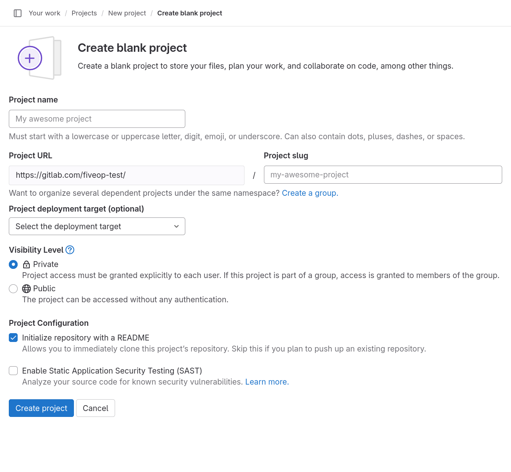
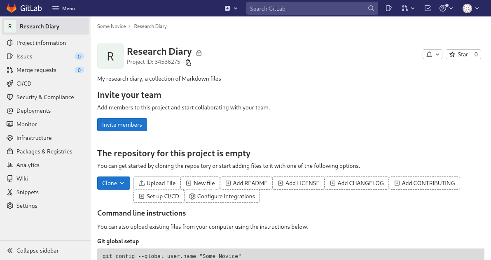

::: questions

- How can I create, modify and archive a GitLab project?

:::

::: objectives

- Create a project.
- Change name, description, visibility, and avatar of a project.
- Archive (or delete) a project.

:::

## Creating a Project

After knowing how to find groups and projects. We want to go from passively
browsing GitLab to actively using it. We are going to create a project and
connect a local Git repository to it.

To create a project, click on the button with the “+” symbol in the top menu bar
and select “New project/repository”.

Multiple options are presented for how to create the new project. In this lesson
we will only look at, and use, the first option: “Create blank project”. So
click on that.

This leads to the following page:

{alt="Create blank project
form with text input fields labeled “Project name”, “Project URL”, “Project
slug”, “Project description (optional)”, “Project deployment target (optional)”,
a radio button element labeled “Visibility Level” with options “Private” and
“Public”, and two checkboxes labeled “Initialize repository with a README” and
“Enable Static Application Security Testing (SAST)”."}

The “Project name” field is for just that, the project name. Its value has no
other purpose and can be changed at anytime without indirect consequences (the
direct consequence being, that its name will be different). We will call it
“Research Diary”.

As we fill in the project name, a project slug gets suggested in the respective
field. The project slug is the last part of the project’s, and the associated
Git repository’s, URL or web address.

If the user belongs to at least one group, the URL’s middle part can be chosen
in the drop-down field labeled “Project URL”, which defaults to the current
user’s username. This is the location for a user’s project (and groups). Other
options in the drop-down list are the groups in which the current user may
create projects.

::: callout

### Project URL and Project Slug

The two fields under labels “Project URL” and “Project slug” are the only fields
in this form for which changing the value later might cause problems. Since
they determine the URL under which the project’s pages and the project’s Git
repository can be found, changing them later might brake links and bookmarks as
well as connections from Git repositories on other systems, for example on
contributors’ machines.

:::

We ignore the field labeled “Project deployment target (optional)”.

The choice of radio button under label “Visibility Level” determines the
project’s visibility. As mentioned in the previous episode “Finding Projects and
Groups”, the visibility “Internal” is disabled on GitLab.com, so only
“Private”, the default, and “Public” are available. We choose “Private”.

If, as per default, the checkbox “Initialize repository with a README” is checked, the project’s repository will be initialized with a commit that adds a file called `README.md`.
Otherwise, a the project will start with an empty repository.
We will add such a file later ourselves, so we uncheck the box.

::: callout

### README

A project’s README file usually contains basic information about the project: what it contains, how it can be used (for example built or installed, if it is a software project), how to contribute, how to get help, and licensing information.

It is common to write README files in Markdown format, indicated by the
filename suffix `.md`.

Platforms like GitLab show the contents of a project’s README file on its
homepage; if it is in Markdown format, in its rendered form.

:::

We will ignore any other fields that may be visible depending on the GitLab
instances configuration.

After clicking the “Create project” button, GitLab creates the project and
redirects us to the project’s homepage, which looks similar to this:

{alt="Project homepage for a new
project. On the left, a menu leading to other project pages: Project
Information, Issues, Merge requests, CI/CD, Security & Compliance, Deployments,
Monitor, Infrastructure, Packages & Registries, Analytics, Wiki, Snippets, and
Settings. On the right, taking up the major part of the width, the project page:
Starting at the top, the project’s name “Research Diary“, followed by its
descriptions “My research diary, a collection of Markdown files”, an
encouragement to “Invite your team” with a button “Invite members”, the
statement that “The repository for this project is empty” with various buttons
for getting initial content into the repository. At the bottom, the beginning of
instructions on how to push an existing repository are visible, but cut off."}

The page is split into the menu on the left and the project overview on the
right.

The menu leads to pages related to various properties, processes, and content of
the project. It is visible on each of these pages. The number of menu entries
may seem overwhelming, in particular when one notices that the entries have
subentries. However, it is not necessary to know what hides behind all these
entries to use GitLab. Following this lesson, we will get to know parts of what
lies behind the entries “Project Information”, “Issues”, “Merge requests”,
“CI/CD”, “Wiki”, and “Settings”.

The project overview shows (from the top): The project’s avatar (or icon), name
and description; a prompt to invite team members (we will cover members later
on); a statement that our repository is currently empty with buttons for
several options to add content to it; and finally the beginning of the
instructions on how to push a local repository to this project’s repository to
fill it with content. We will follow them in just a bit.

The project overview page will look slightly different, once we have content in
its repository. We will have another look at the page then.

::: challenge

### Change Name, Description, Visibility, or Avatar

Click on the “Settings” menu entry.
Set the description to “My research diary, a collection of Markdown files”.

The project description appears in many lists and on some pages under the
project’s name.

Then change any of the project’s name, visibility, and avatar.
Do not forget to click the “Save changes” button once you are done.

This exercise should take about 5 minutes.

:::

::: callout

### Markdown

Markdown is a markup language, like HTML on which the World Wide Web is based or
wikitext used to write Wikipedia’s content. Its markup directives, indicating
for example that something is a headline or a list item, are such that they
serve their purpose even in the plain text form.

There exist many variants (or flavors) of Markdown and GitLab has [its
own](https://docs.gitlab.com/ee/user/markdown.html). Other than for rendering
Markdown files in repositories on its web interface, GitLab allows for Markdown
input in many of its interface’s text fields, such as issue descriptions or
comments.

This will be pointed out as we get to use these fields during the lesson.

:::

The project overview page presents us with many options to add content to the project’s repository directly in GitLab.
We will add our first file to the project repository in the next episode.

## Archiving a Project

We just went through the beginning of a GitLab project’s life cycle.
At its end, if it has one, a project gets archived (or deleted).
We will now go through the process of archiving a project, without completing the procedure.

Using the menu on the left, we navigate to the project’s settings.

At the bottom of the page, we find a section named “Advanced”.
We hit the “Expand” button right next to it and scroll down the page.

Notice that many of buttons here are not the usual blue or white, but after
scrolling a little they are red. This indicates that we should be careful about
clicking them. Things might break or get deleted.

Scrolling back up, we find a section labeled “Archive Project”. Clicking the
button will not delete the project. Instead it will be placed in a read-only
mode. Everything will be preserved but nothing can be changed anymore. In
addition, the project no longer shows up in search results and on the page for
exploring projects.

Most of the time archiving a project is preferable to deleting it, in particular
when it comes to research projects. **Do not archive the project now! We will
work with it throughout this lesson.**

At the bottom of the page is also a section for deleting a project, in case you
ever think that is the right thing to do.

::: keypoints

- Creating a GitLab project requires not more than a few clicks and providing a name.
- Changing the name of description of a GitLab project after creation has no indirect consequences.
- You can archive a project (and you can delete a project, but often should not.)

:::
