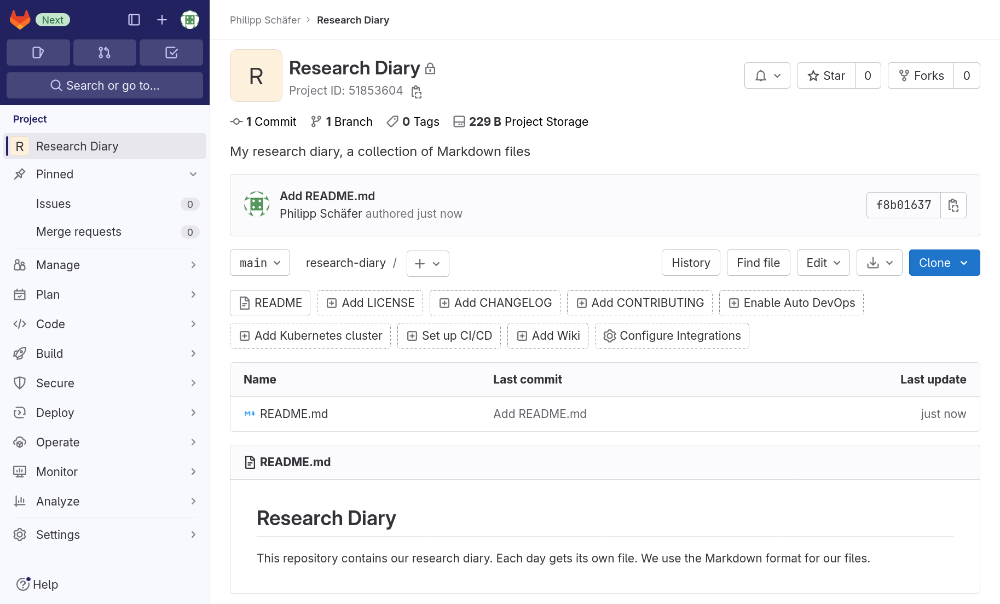

::: questions

- How can I add files to my GitLab project?

:::

::: objectives

- Push a local Git repository to a newly created project.

:::

## Configuring Git

Before we initialize a local Git repository, we make sure that Git is properly
configured.

To check for our name and email address, We run

```
$ git config --global --get user.name
```
{: .language-bash}

and

```
$ git config --global --get user.email
```
{: .language-bash}

If both return sensible values, we are good to go. Otherwise we provide the
missing values, for example:

```
$ git config --global user.name "Some Novice"
$ git config --global user.email "some.novice@example.com"
```
{: .language-bash}

It is now common to name the default branch `main`, rather than `master` as is
still the default in Git. For more information see, for example, the
[announcement of GitLab to change the default
branch](https://about.gitlab.com/blog/2021/03/10/new-git-default-branch-name/)
Since the discussion on this topic has started, Git has introduced a
configuration value for the initial branch created by the `git init` command. We
will use this, to make sure that all future repositories created locally start
with a branch called `main`:

```
$ git config --global init.defaultBranch main
```

## Creating a Local Repository

::: callout

### Markdown Headlines

In Markdown, headlines are marked by one up to six `#` characters followed by a
space character in front of the text. The number of `#` characters indicates the
heading’s level, with 1 being the most significant.

For example, a level 3 headline:

```
### Interesting Section Title
```

:::

::: challenge

### Research Diary’s Initial Content (Required)

Create a Git repository anywhere on your computer. Add a README file in
markdown format that describes the repository’s future contents.

Remember to use a [good commit message][CommitMessages] for your commit.

This exercise should take about 10 minutes.

:::: solution

We start by creating and navigating to a new directory, `research-diary`. There
we initialize a git repository.

```
$ mkdir research-diary
$ cd research-diary
$ git init
```

Next we create a file called `README.md` with the following content using our
preferred text editor.

```
# Research Diary

This repository contains our research diary.
Each day gets its own file.
We use the Markdown format for our files.
```

Finally, we stage the added file using and create a commit.

```
$ git add README.md
$ git commit -m "Add README.md"
```

::::

:::

[CommitMessages]: https://cbea.ms/git-commit/

Checking the status of the git repository, we should see that it exists and that
there are no changes in the working directory or in the stating area:

```
$ git status
```
{: .language-bash}
```
On branch main
nothing to commit, working tree clean
```
{: .output}

There is one file, `README.md`:

```
$ ls
```
{: .language-bash}
```
README.md
```
{: .output}

## Connecting Local and Remote Repository

Having thus created our local repository, we want to save it to our repository
in GitLab. To that end, we have a look at the project overview page again; this
time at the instructions toward the bottom of the page. They read:

> **Git global setup**
>
> ```
> git config --global user.name "Some Novice"
> git config --global user.email "some.novice@example.com"
> ```
>
> **Create a new repository**
>
> ```
> git clone https://gitlab.com/somenovice/research-diary.git
> cd test
> git switch -c main
> touch README.md
> git add README.md
> git commit -m "add README"
> git push -u origin main
> ```
>
> **Push an existing folder**
>
> ```
> cd existing_folder
> git init --initial-branch=main
> git remote add origin https://gitlab.com/somenovice/research-diary.git
> git add .
> git commit -m "Initial commit"
> git push -u origin main
> ```
>
> **Push an existing Git repository**
>
> ```
> cd existing_repo
> git remote rename origin old-origin
> git remote add origin https://gitlab.com/somenovice/research-diary.git
> git push -u origin --all
> git push -u origin --tags
> ```

We already covered the global setup.

The next three sets of instructions are mutually exclusive. The first is not for
us, because we already created a repository. Neither is the second, because
although we have a directory with contents, its already a Git repository. That
leaves us with the third option, which is the one applicable to our situation:
“Push an existing Git repository.”

Transferring our changes to a remote repository is called **push**ing, because
we are sending the changes from us, the local repository, to somewhere else, a
remote repository. Later on we will “**pull**” changes from a remote repository,
completing the analogy.

Going back to the shell, we configure our project’s repository as a remote in
our local repository:

```
$ git remote add origin https://gitlab.com/somenovice/research-diary.git
```
{: .language-bash}

::: callout

### https:// vs git@

We assume throughout this lesson that the user has no SSH key is configured,
because we do not want to make the setup of such a key a prerequisite.

If however, a user has configured an SSH key for their account, GitLab would
default to showing links to repositories in the form for Git over SSH instead.

For example, without a configured key GitLab shows

`https://gitlab.com/somenovice/research.git`

for our example repository, whereas with a configured key it would show

`git@gitlab.com:somenovice/research.git`.

The HTTPS link still works if a SSH key is configured, it is only no longer
shown by default.

:::

We instruct Git to add a remote called `origin` with the last part as the
address. Make sure to copy that last part from the project overview page,
because it represents the Git address of your project’s repository on GitLab. It
will be different for everyone.

Note also, that we skipped the second line of the instructions. It renames an
existing remote `origin` to `old-origin`, but we have no existing remote.

::: callout

### Names for remotes

Apart from following restrictions that Git puts on remote names, which can be
avoided without much thought by using only letters, numbers, underscores, and
hyphens, we should choose meaningful names for remotes, in particular, when we
add multiple remotes to a local repository.

In most examples, `origin` is used as the name for a remote, because it is the
name of the remote created when cloning a repository. It is a meaningful name
for the main remote repository, if there is one. This together with its
ubiquitous use make it a very good name.

In other cases, we might call a remote to a private copy of the main repository
after our username or server it is located on, for example `uni` for a
university GitLab instance.

:::

Finally, we push our changes to the remote repository. The command will prompt
for our user name and password:

```
$ git push -u origin --all
```
{: .language-bash}
```
Enumerating objects: 3, done.
Counting objects: 100% (3/3), done.
Writing objects: 100% (3/3), 250 bytes | 250.00 KiB/s, done.
Total 3 (delta 0), reused 0 (delta 0), pack-reused 0
To https://gitlab.com/somenovice/research-diary.git
 * [new branch]      main -> main
branch 'main' set up to track 'origin/main'.
```
{: .output}

Having successfully pushed our commit to the GitLab repository, we change to our
browser and navigate to the project (or reload it, if we still have it open).
We will be greeted by the project homepage, similar to the following
screenshot:

{alt="Project homepage
of a project. On the left, a menu leading to other project pages. On the right,
taking up most of the width, the project homepage. Starting from the top, we
first have the project title, Research Diary, followed by a line of statistical
values (1 Commit, 1 Branch, 0 Tags, 72KB files, 72 KB Storage). Under these we
see the description: “My research diary, a collection of Markdown files”. In
the next line we see a drop-down field for branches showing “main”, the project
slug¸“test”, a drop-down button labeled “+”, and buttons labeled “History”,
“Find file”, “Web IDE”, a download symbol, and ”Clone”. This is followed by a
box giving information on the last commit of the current branch: the commit
message “Add README.md”, the authors name and how far in the past the commit was
authored, as well as prefix of the commit’s hash with a copy-to-clipboard
button. This is followed by some buttons that allow to add or upload new files
or setup some of GitLab features for the project. Next is a list of files, in
this case only `README.md`, with information when it was last updated and
through which commit. Finally, we see a rendering of `README.md`."}

Let us look at what has changed compared to its initial state. The interface
elements encouraging us to add members to the project are gone. Of course, we
can still navigate to the project’s Members later on, if we need to. We also,
correctly, no longer get told that the repository is empty and the instructions
on how to push content to the repository have vanished.

Instead, we see some statistics below the project’s title: 1 Commit, 1 Branch, 0
Tags, 72 KB Files, 72 KB Storage. They double as buttons other project pages.

Below the description is a new button bar, followed by a box presenting
information on last commit of the currently select branch.

The buttons below, that we saw earlier, allow us to add specific files or
navigate to the configuration of certain GitLab features. Note that one button
changed from reading “Add README” to just “README”, since we added `README.md`.
The button is now a link to the latest version of that file in the current
branch.

Then we see a list of files. So far, there is only `README.md`. The list also
tells us through which commit it was last changed and when that commit was
created.

Finally, we see the markdown file `README.md` rendered. Because having a
README-file in the root directory of a repository is a widespread convention,
GitLab (and other platforms like it) usually render it on a project’s homepage.

::: keypoints

- You can fill a fresh GitLab project’s repository by pushing a local repository.

:::
