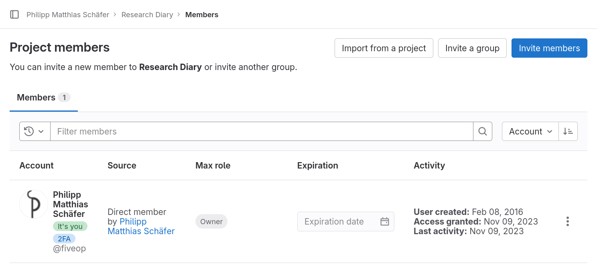

::: questions

- How can multiple people collaborate on a project?

:::

::: objectives

- Explain the concepts of members and roles.
- Add a member to a project.
- Contribute to a project that you are a member of.

:::

::: instructor

This episode consists of two alternative parts.

The first alternative uses Git for collaboration.
It consists of the first and second section.

The second alternative uses GitLab’s web interface for collaboration.
It consists of the first and third section.

:::

## Adding Project Members

So far, each of you has created a GitLab project that no one but you can
contribute to; depending on the visibility setting, no one but you might be able
to even see it.

Git and GitLab can be and is used for one-person projects. But we want our
colleagues to contribute to our research diary, when they keep tabs on our
experiments for us on the weekends. To achieve this, we will grant others access
to our GitLab project.

Using the menu on the left side of the project homepage (or nearly any other
project page), we navigate to the project members page hovering over or clicking
on “Project Information” and then clicking on “Members” in the submenu. The
project member page should look similar to the following screenshot:

{alt="Webpage coutout titled
“Project Members” with three buttons next to the title: “Import from a project”,
“Invite a group”, and “Invite members”. Below a table listing the project’s
members, showing account holder‘s name with account name, the membership source,
when access was granted, the member’s maximum role and the membership expiration
date. The table contains one column: ”Philipp Matthias Schäfer, @fiveop, Direct
member, 2 weeks ago by himself, Maintainer, and no Expiration date."}

On the page we can see the page title, “Project members”, three buttons to the
left of the title, and a filterable table of members, currently only listing
ourselves.

The table shows our full name and account name, why we are a member of this
project, when we got access—at the moment we created the project—what our
maximum role is—more on that in a bit—and a disabled membership expiration date
widget.

For practice we will all add an instructor to our project and remove them again
right away. Click the button labeled “Invite members”, type in the username your
instructors provided you with into the search field, make sure that “Guest” is
selected as a role, and click the button labeled “Invite”.

After reloading the page, your instructor should now be listed next to you in
the table. Unlike in your row, you can change the role and the expiration date
of this new entry. There also is a new, red button in this row labeled “Remove
member”.

The role determines what the member is allowed to do in the project. A
maintainer has full rights, a guest almost none. GitLab’s handbook gives a
detailed [overview](https://docs.gitlab.com/ee/user/permissions.html) of the
different roles’ permissions.

Now, we are going to remove the instructor from your project’s members again.
Click the button labeled “Remove member” in the instructor’s row then click the
button of the same name in the popup dialog. The page reloads itself and the
entry vanishes from the table.

::: challenge

### Adding Members

Get into pairs and add each other with the role “Developer” to your projects.

The “Developer” role grants just enough permissions for all the collaborative
tasks we will practice in this lesson.

This exercise should take about 5 minutes.

:::

## Contribute Changes to Project Repository (using Git)

Now, everyone should be the member of one of your co-learners’ projects. We will
now add an diary entry for imaginary work that we did on their experiments last
weekend.

First, we clone their repositories into the directory `rd-colleague`.

```
$ git clone https://gitlab.com/someothernovice/research-diary.git rd-colleague
```
```
Cloning into 'research-diary'...
Username for 'https://gitlab.com': somenovice
Password for 'https://somenovice@gitlab.com':
remote: Enumerating objects: 3, done.
remote: Counting objects: 100% (3/3), done.
remote: Compressing objects: 100% (2/2), done.
remote: Total 3 (delta 0), reused 0 (delta 0), pack-reused 0
```

Moving into the directory

```
$ cd rd-colleague
```

we check its contents. If your colleague did everything we did, it should
contain a single file, `README.md`.

```
$ ls
```
```
README.md
```

Now we are sure that everything is in order with the cloned repository and we
can add our lab entry.

First we create a file, named `2022-03-13.md` after the date on which we did the
work, listing the work we did:

```
* Injected transformational fluid into moss sample.
* Moss turned into several butterflys. SUCCESS!
```

```{r, child=c('markdown-lists.md')}
```

Then we add the file as part of a new commit to the repository:

```
$ git add 2022-03.13.md
$ git commit -m "Record work on experiment A-13"
```
```
[main 4eac24c] Record work on experiment A-13
 1 file changed, 2 insertions(+)
 create mode 100644 2022-03-13.md
```

We check Git’s log for our commit:

```
$ git log -n 1
```
```
commit 4eac24cafbcebc4f0d528bd2e1246a4624265085 (HEAD -> main)
Author: Some Novice <some.novice@example.com>
Date:   Thu Mar 17 16:00:23 2022 +0000

    Record work on experiment A-13
```

And everything seems to be in order, so we push our change.

```
$ git push
```
```
Username for 'https://gitlab.com': somenovice
Password for 'https://somenovice@gitlab.com':
Enumerating objects: 4, done.
Counting objects: 100% (4/4), done.
Delta compression using up to 4 threads
Compressing objects: 100% (3/3), done.
Writing objects: 100% (3/3), 388 bytes | 388.00 KiB/s, done.
Total 3 (delta 0), reused 0 (delta 0)
To https://gitlab.com/somenovice/research-diary.git
   2dd2c21..4eac24c  main -> main
```

We have now recorded in pairs lab work we carried out for a colleague during the
last weekend. Curious what our colleagues did for us, we navigate back to the
directory of our own repository in the shell, for example:

```
$ cd ../research-diary
```

There, we pull the changes that our colleagues previously pushed.

```
$ git pull
```
```
Username for 'https://gitlab.com': somenovice
Password for 'https://somenovice@gitlab.com':
Updating 2dd2c21..4eac24c
Fast-forward
 2022-03-13.md | 2 ++
 1 file changed, 2 insertions(+)
 create mode 100644 2022-03-13.md
```

From the output’s last line, we can already see that a single file,
`2022-03-13.md` was added. Letting the shell write out the files contents shows
us, what our colleague did:

```
$ cat 2022-03-13.md
```
```
* Started the centrifuge.
* Put the used tools in the autoclave.
```

We successfully collaborated through GitLab on a project of text files.

## Contribute Changes to Project Repository (using GitLab WebIDE)

Now that we are members of the project of one of our co-learners, we can contribute to each others projects.
We will add an diary entry for imaginary work that we did on their experiments last weekend.

To navigate to our co-learner's project, we open the burger menu in the upper left corner of the page, select “Projects” and click on “View all projects”.
The list under “Your projects” should now contain at least two projects: the one we created ourselves in the beginning and the project of our co-learner.
We click on the name of our co-learner’s project to navigate to it’s homepage.

To add a file, we click on the button labeled “Web IDE” in the line just below the
project’s description. This redirects us to a page with a file browser in a
column on the left, with most of the screen taken up by a box informing us how to use
the Web IDE: “Select a file from the left sidebar to begin editing. Afterwards,
you’ll be able to commit your changes.”

We do not want to edit an existing file, but want to create a new one. To do
that we click on the button above the list of files on the left that is marked
with an icon representing a sheet of paper with a +-sign on top of it.

A pop-up dialog prompts us for a name, which we will provide: `2022-03-13.md`, the date in which we did the work in the laboratory.
Then we click the button labeled “Create file”.

We see the result of our action in two ways: A file named `2022-03-13.md`
appeared in the list of files on the left and a tab labeled `2022-03-13.md`
showing an text editor appeared in the space to the right of the list of files.

We will now add something similar the following lines in the editor:

```markdown
* Started the centrifuge.
* Put the used tools in the autoclave.
```

```{r, child=c('markdown-lists.md')}
```

Next we click the button labeled “Create a commit” and change the commit message to

```
Record work on experiment A-13
```

We change the selection from “Create a new branch” to “Commit to main branch”.
The web interface close the dialog and inform us that the commit was created.

We use the the project view to navigate to our own project.
In the list of files, we should see the file added by our co-learner.

::: keypoints

- Adding others as members allows them to directly contribute to your projects
- Members with sufficient rights can independently contribute to repositories
- Alternative Git: You update your local repositories relative to the GitLab repository with the `git pull` command
- Alternative Git: You send changes committed in your local repository to the GitLab repository with the `git push` command.

:::
