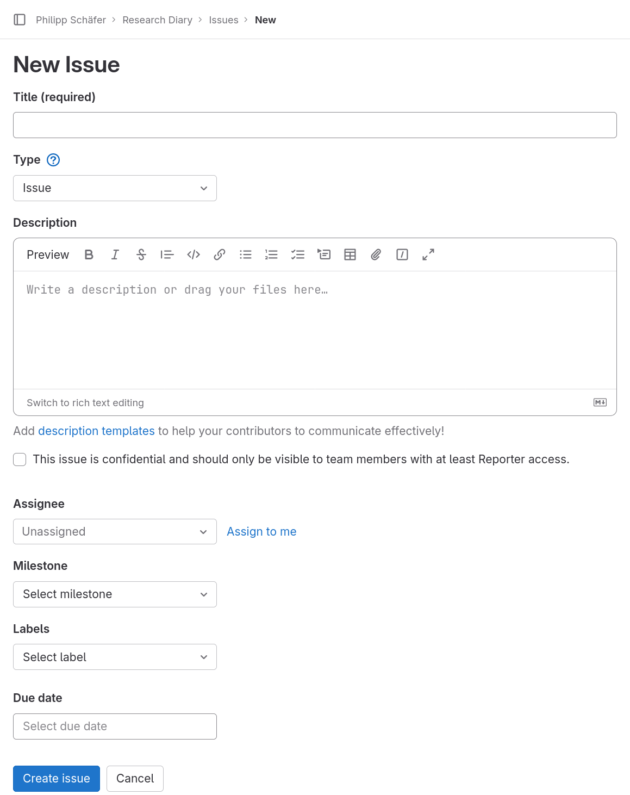

::: questions

- How can I use GitLab to manage development or a whole project?

:::

::: objectives

- Create an issue.
- Comment on an issue.
- Close an issue.
- Use boards to get an overview the state of issues.

:::

## Create Issue

Before our excursion to learn about groups, we contributed lab notes to our
co-learner’s repository. Having done that, we think we should be listed as
contributors in the documentation of that repository. Since, we want our
co-learner to do the honors, we create an issue in their repository.

With our co-learner’s help, we navigate to their project. On the side bar menu
on the left we click the entry labeled “Issues” and on the following page we
click on the button labeled “New issue”.

This leads us to the following form:

{alt="New issue form with a text input field
labeled “Title” with subscript “Add description templates to help your
contributors communicate effectively!”, the second and third word being a link,
a drop-down field labeled “Type” showing the word “Issue“, a multi-line text
input field with buttons for text formatting labeled “Description”, a check box
labeled “This issue is confidential and should only be visible to team members
with at least Reporter access.”, drop-down fields labeled “Assignee“,
“Milestone”, and “Label” showing “Unassigned“, “Milestone”, and “Labels”,
respectively, a date input field labeled “Due date”, and two buttons labeled
“Create Issue” and “Cancel”."}

For our issue we provide a short, descriptive title, for example “Recognize
outside contributors” and a description:

```
Outside contributors should be mentioned in the project’s documentation. Their
names could be listed in one of the following locations:

* a section of `README.md`
* a separate `CONTRIBUTORS.md` file
```

::: callout

### Markdown Code Spans and Blocks

Markdown provides syntax for formatting text in a monospaced font, this is
usually used to typeset code, because code is usually written to be readable in
such fonts.

For a monospaced snippet within a normal paragraph, enclose the snippet in a
single backquote (also called backtick or grave accent), for example

```
The filename `README.md` will be set in a monospaced font.
```

will be typeset as:

The filename `README.md` will be set in a monospaced font.

For a whole block of monospaced text, for example some lines of code, start and
end the block with a line consisting of three or more backquotes, where the
number should match for start and end, for example

````
```
# This python code will also be set in a monospaced font, which preserves
# relative indentation between lines.
def some_function():
    pass
```
````

will be typeset as:

```
# This python code will also be set in a monospaced font, which preserves
# relative indentation between lines.
def some_function():
    pass
```

:::
